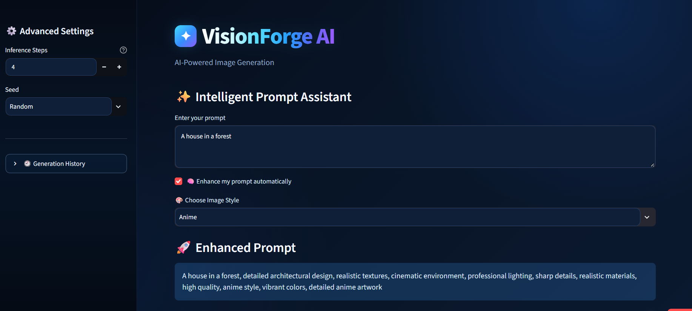
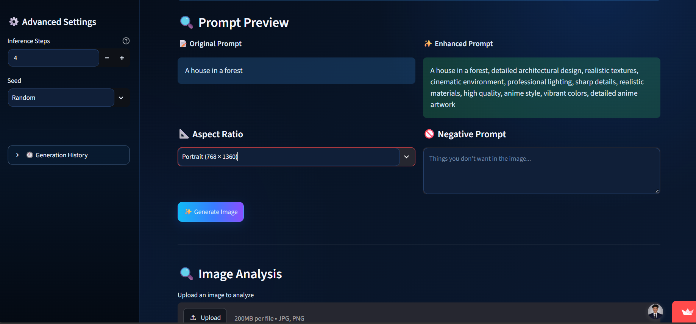
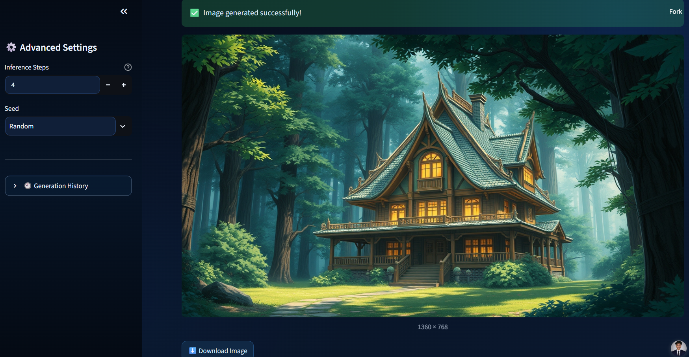
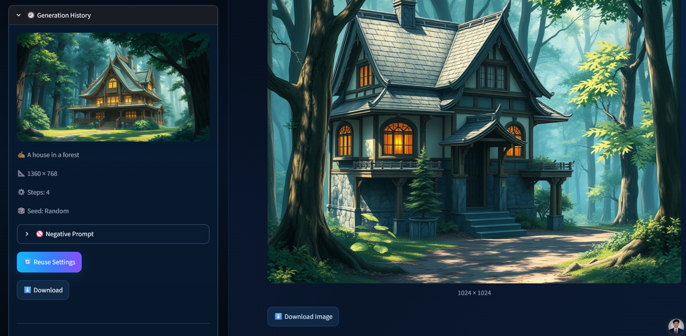

# 🎨 VisionForge AI

**AI-Powered Multimodal Image Generation & Vision Understanding Platform**

VisionForge AI is a Streamlit-based AI application that combines **text-to-image generation** with **AI-powered image understanding**. It allows users to create images from natural-language prompts and analyze uploaded images using vision models.

---

## 🚀 Live Demo

🌐 **Streamlit Cloud:**  
`https://visionforge-ai-zfiqtrdyz6o9oaavsr89rz.streamlit.app/`

💻 **GitHub Repository:**  
`https://shitsukendu.github.io/VisionForge-AI/`

> Replace the two placeholders above with your actual links.

---

## ✨ Features

### 🎨 AI Image Generation
- Text-to-image generation using **FLUX.1-schnell**
- Multiple aspect ratios:
  - Square — 1024 × 1024
  - Landscape — 1360 × 768
  - Portrait — 768 × 1360
- Adjustable inference steps
- Random or fixed seed generation
- Negative prompt support
- Image download

### 🧠 Intelligent Prompt Assistant
- Automatically enhances simple prompts
- Category-aware prompt enhancement
- Supports objects, animals, vehicles, people, architecture and more
- Original vs. enhanced prompt preview

### 🎭 Multiple Image Styles
Choose from:
- 📷 Realistic
- 🎬 Cinematic
- 🎨 Digital Art
- 🌸 Anime
- 🧊 3D Render

### 🚫 Smart Negative Prompt
Automatically adds common unwanted visual characteristics such as:
- Blurry results
- Low quality
- Distortion
- Deformation
- Duplicate objects
- Unwanted text
- Watermarks
- Cropping issues

### 🔍 AI Image Analysis
Upload JPG, JPEG or PNG images and analyze them with:
- **BLIP** — AI image description
- **CLIP** — semantic visual understanding
- Main subject detection
- Visual category matching
- Dominant color extraction
- Image dimensions and format
- AI-generated visual insights

### 🕘 Generation History
- Stores generated images during the session
- Displays prompts and generation settings
- Reuse previous settings
- Download previous generations

---

## 🛠️ Tech Stack

| Technology | Purpose |
|---|---|
| Python | Core programming |
| Streamlit | Web application UI |
| Hugging Face Hub | AI model inference |
| FLUX.1-schnell | Text-to-image generation |
| BLIP | Image captioning |
| CLIP | Visual semantic understanding |
| PyTorch | Deep learning framework |
| Transformers | Vision model integration |
| Pillow | Image processing |
| python-dotenv | Environment variable management |

---

## 🏗️ Application Architecture

```text
                    ┌──────────────────────┐
                    │    VisionForge AI    │
                    └──────────┬───────────┘
                               │
              ┌────────────────┴────────────────┐
              │                                 │
              ▼                                 ▼
     ┌─────────────────┐              ┌─────────────────┐
     │ Image Generation│              │ Image Analysis  │
     └────────┬────────┘              └────────┬────────┘
              │                                │
              ▼                                ▼
     Intelligent Prompt                  Uploaded Image
          Assistant                           │
              │                                │
              ▼                       ┌────────┴────────┐
       Style Selection                │                 │
              │                       ▼                 ▼
              ▼                      BLIP              CLIP
       Negative Prompt                │                 │
              │                       ▼                 ▼
              ▼                 Description      Visual Concepts
        FLUX.1-schnell
              │
              ▼
        Generated Image
```

---

## 📸 Project Screenshots

Add your four screenshots inside a `screenshots` folder in the project:

```text
VisionForge-AI/
│
├── app.py
├── requirements.txt
├── README.md
├── .gitignore
│
└── screenshots/
    ├── home.png
    ├── generation.png
    ├── analysis.png
    └── history.png
```

Then replace the image section below with your actual screenshot filenames if needed.

### 🏠 Home / Prompt Assistant



### 🎨 AI Image Generation



### 🔍 Image Analysis



### 🕘 Generation History



---

## ⚙️ Installation

### 1. Clone the repository

```bash
git clone YOUR_GITHUB_REPOSITORY_LINK
cd VisionForge-AI
```

### 2. Create a virtual environment

```bash
python -m venv .venv
```

Activate it on Windows:

```powershell
.venv\Scripts\activate
```

### 3. Install dependencies

```bash
pip install -r requirements.txt
```

### 4. Configure Hugging Face Token

Create a `.env` file in the project root:

```env
HF_TOKEN=your_huggingface_token
```

Do **not** commit your `.env` file to GitHub.

### 5. Run the application

```bash
streamlit run app.py
```

---

## 🔐 Environment Variables

The application requires:

```env
HF_TOKEN=your_huggingface_token
```

For deployment on Streamlit Cloud, add the token through **App Settings → Secrets** instead of uploading the `.env` file.

---

## ☁️ Streamlit Cloud Deployment

1. Push the project to GitHub.
2. Open Streamlit Community Cloud.
3. Create a new app.
4. Select the GitHub repository.
5. Select `app.py` as the main file.
6. Add your `HF_TOKEN` under Streamlit Secrets.
7. Deploy the application.

---

## 📁 Project Structure

```text
VisionForge-AI/
│
├── app.py
├── requirements.txt
├── README.md
├── .gitignore
└── screenshots/
    ├── home.png
    ├── generation.png
    ├── analysis.png
    └── history.png
```

---

## 🎯 Project Highlights

- AI-powered text-to-image generation
- Intelligent prompt enhancement
- Style-aware image generation
- Smart negative prompting
- Image captioning with BLIP
- Semantic visual understanding with CLIP
- Dominant color extraction
- Generation history and settings reuse
- Streamlit-based interactive interface

---

## 🔮 Future Improvements

- More advanced prompt controls
- Additional image generation models
- Image-to-image generation
- Advanced vision-language interaction
- More visual analysis categories
- Cloud-based model optimization
- Improved generation history persistence

---

## 👨‍💻 Author

**Sukendu Shit**

B.Tech CSE — AI/ML Specialization

🔗 GitHub: `https://github.com/shitsukendu`

---

## 📄 License

This project is intended for educational, portfolio, and demonstration purposes.
